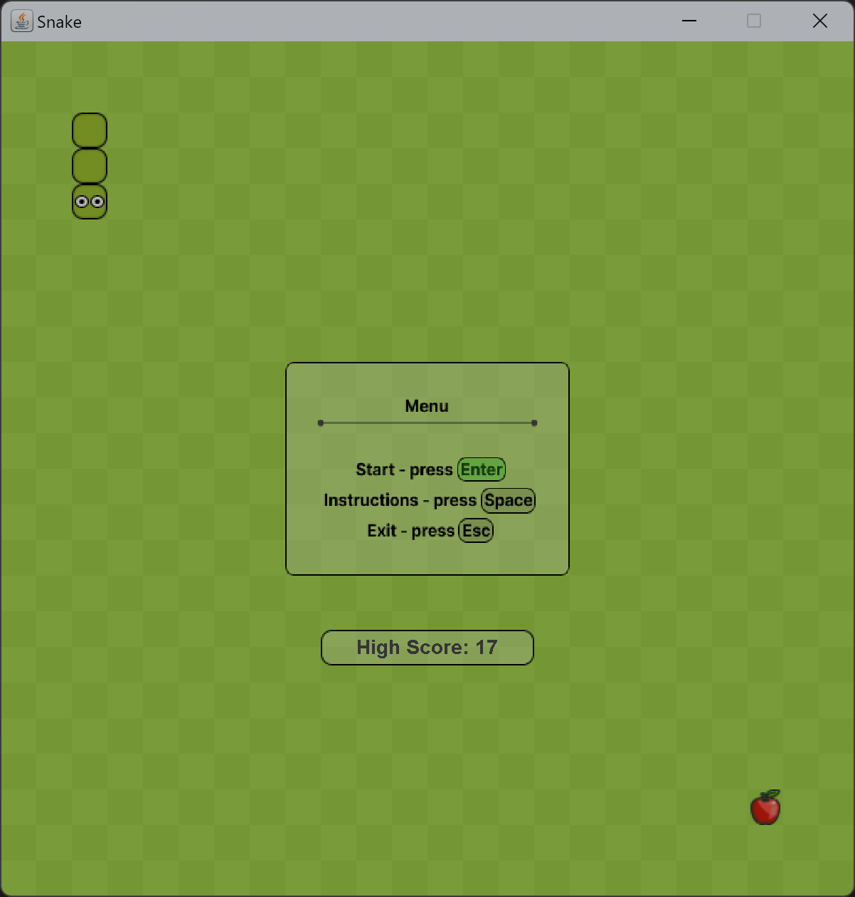
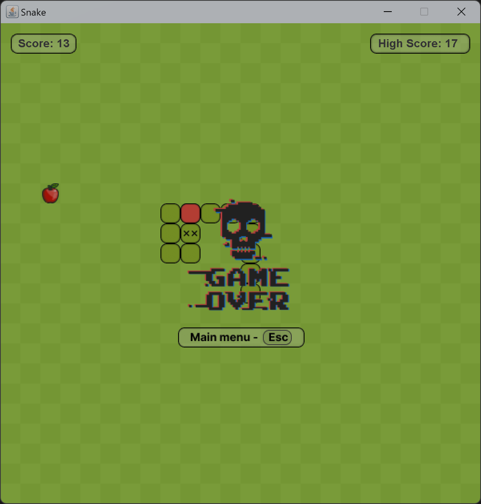
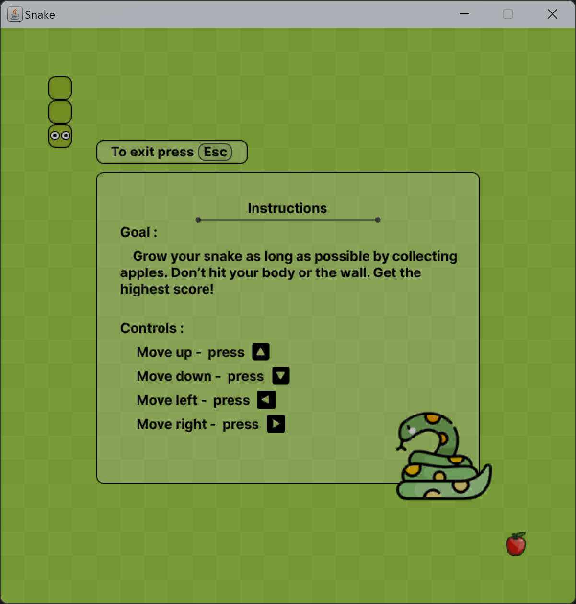

# 🐍 Snake Game

[](https://www.oracle.com/java/technologies/javase/jdk11-archive-downloads.html)
[](https://maven.apache.org/)
[](LICENSE)
[](https://github.com/theinfinull/snakegame-java)

A classic Snake game built from scratch with Java Swing.

## Screenshots

<div align="center">
  
  
  
</div>

## 📋 Prerequisites

- **JDK 11** or higher installed on your system
- **Maven** (optional, for building from source)

## 🚀 Getting Started

### Clone the Repository

```bash
git clone https://github.com/theinfinull/snakegame-java.git
cd snakegame-java
```

### Running the Game

#### Option 1: Using Run Scripts

- **Windows**: Double-click `run.bat`
- **Linux/macOS**: Run `./run.sh` or double-click `run.sh`

#### Option 2: Using Maven

```bash
# Compile the project
mvn clean compile

# Run the game
java -cp target/classes com.infinull.App
```

#### Option 3: Using JAR File

```bash
# Build the JAR file
mvn clean package

# Run the JAR
java -jar target/snakegame.jar
```

## 🎮 How to Play ?

1. **Start the game** using any of the methods above
2. **Navigate the menu** using arrow keys or mouse
3. **Control the snake** using arrow keys:
   - ⬆️ Up Arrow - Move up
   - ⬇️ Down Arrow - Move down
   - ⬅️ Left Arrow - Move left
   - ➡️ Right Arrow - Move right
4. **Eat food** to grow longer and increase your score
5. **Avoid walls and yourself** - Game over if you hit them!
6. **Beat your high score** and challenge yourself!

## 📁 Project Structure

```
snakegame-java/
├── src/
│   └── main/
│       ├── java/
│       │   └── com/infinull/
│       │       ├── App.java          # Main entry point
│       │       ├── SnakeGame.java    # Game logic
│       │       ├── SnakeMenu.java    # Menu system
│       │       └── Config.java       # Configuration
│       └── resources/
│           ├── snake/                # Snake sprites
│           ├── food/                 # Food sprites
│           ├── highscore/            # High score data
│           └── *.png                 # UI assets
├── sample/                           # Screenshots
├── pom.xml                           # Maven configuration
├── run.sh                            # Linux/macOS run script
└── run.bat                           # Windows run script
```

## 📝 License

This project is open source and available under the [MIT License](LICENSE).

---

<div align="center">
  <p>Made with ❤️ using Java</p>
  <p>⭐ Star this repo if you find it helpful!</p>
</div>
